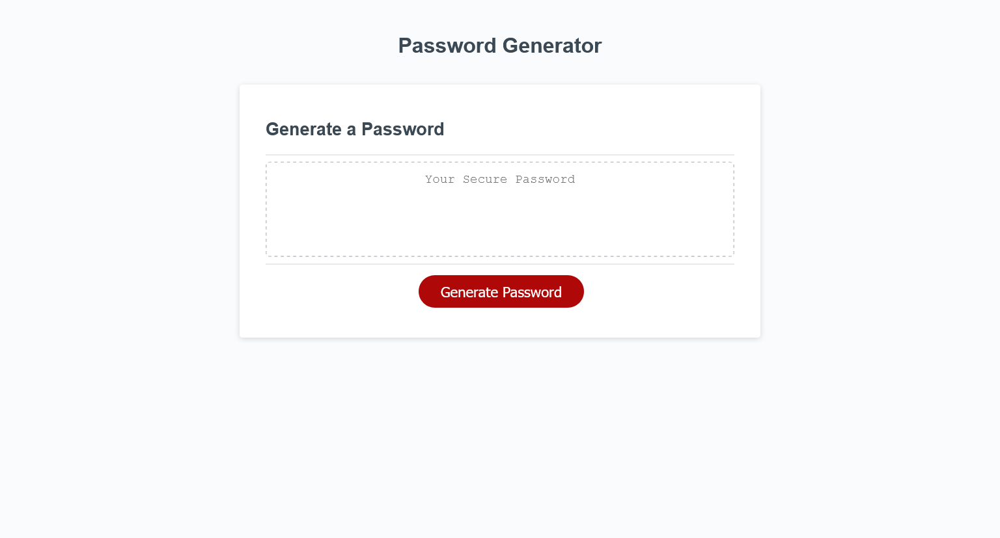

# Password-Generator
### This is a quick, customizable random password generator intended to meet high security criterias for sensitive data.
 

#

## **What was the employer's User Story?**
* The employer wanted to randomly customize and generate a password that meets the strong password criteria, providing high security.
 

## **What changes have been made to the code?**
* HTML - Added comments to help other developers understand the code.
* JS - Formulated logic statements and loops to meet the objective of this project. gave a clean and organized look to the password generator process.
 

 

## **Password Generator Page**

 

### Click [here](https://nevan-dsouza.github.io/Password-Generator/) to view the page
 
